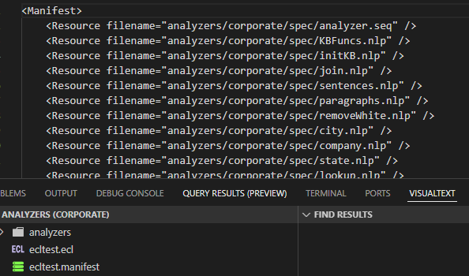

# Using NLP Engine C++ Library Files in C++

This is example code on how to use the NLP Engine's C++ library codes in a C++ program. There is a CMakeLists file and a mainl.cpp file which include and uses the NLP Engine library.

It assumes there are three analyzers in the analyzers folder. The name of the analyzers folder needs to be “analyzers”.
The analyzers that appear in this example are legacy and some no longer exist. It is expected that programmers test with their own set of analyzers.

1. taiparse (it has since been renamed to the parse-en-us)
2. corporate
3. noop (no longer exists)

## Real Usage

The NLP Engine C++ library files have been used in various places for now: the Python NLPPlus package, and the HPCC Systems supercomputer plugin.

### Python NLPPlus package

The NLPPlus package uses the NLP Engine C++ libraries and is built using This module is built using the
[scikit-build-core](https://scikit-build-core.readthedocs.io/en/latest/index.html)
and [nanobind](https://nanobind.readthedocs.io/en/latest/index.html) modules. It was originally designed by
Canadian David Huggins-Daines who was contracted by Conceptual Systems.

The repository for the Python NLPPlus package is found here: [https://github.com/VisualText/py-package-nlpengine](https://github.com/VisualText/py-package-nlpengine).

### HPCC Systems

The HPCC Systems NLP++ plugin was designed and coded by David de Hilster while working at LexisNexis Risk. It allows for 
those using the HPCC Systems Supercomputing framework to natively call NLP++ analyzers inside of ECL. 

The repository for the HPCC Systems NLP plugin is found at [https://github.com/hpcc-systems/HPCC-Platform/tree/master/plugins/nlp](https://github.com/hpcc-systems/HPCC-Platform/tree/master/plugins/nlp).

There are two special menu items in VisualText (the VSCode NLP++ language extension which is called VisualText) that creates an ECL file and 
another that creates a manifest file. Here is how to use VisualText to create and use the HPCC NLP++ plugin:

1. Create an folder named "analyzers" and place all the NLP++ analyzers you want to use with the HPCC NLP plugin.
2. Right-click inside the Analyzer View and choose "New ECL File" and choose the template you want to use.
3. Edit the ECL file to your needs.
4. Select the ECL file in the Analyzer View, right-click, and choose "Generate HPCC Manifest File".
5. Choose the analyzers you wish to push to the HPCC Systems server and hit ok.
6. You should now see a manifest file appear in the Analyzer View.

Here is a snapshot of what you will see in VisualText (VSCode NLP++ language extension):

